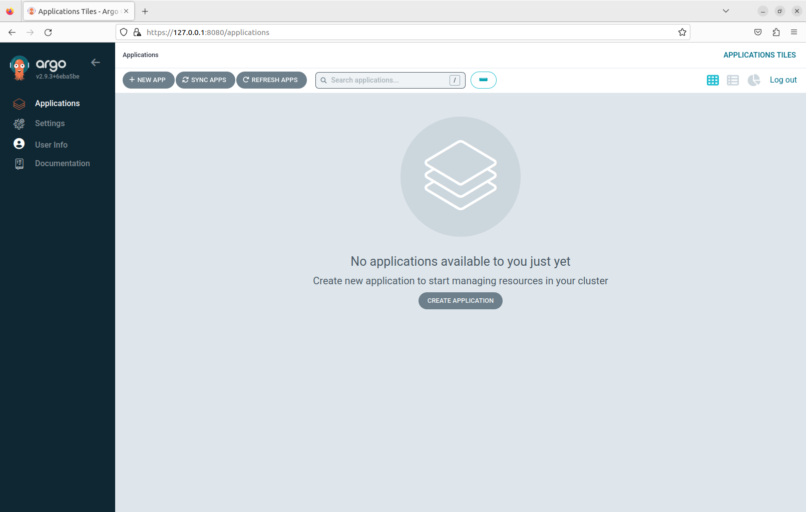

## Installation

Create a k3d cluster named 'argo'.

```bash
k3d cluster create argo
```

Create a Kubernetes namespace called 'argocd'.

```bash
kubectl create namespace argocd
```

Apply the Argo CD installation manifest in the 'argocd' namespace.

```bash
kubectl apply -n argocd -f https://raw.githubusercontent.com/argoproj/argo-cd/stable/manifests/install.yaml
```
You can get pods in the 'argocd' namespace and watch for changes.

```bash
kubectl get po -n argocd -w
```

Forward traffic from local port 8080 to the 'argocd-server' service on port 443 in the 'argocd' namespace.

```bash
kubectl port-forward svc/argocd-server -n argocd 8080:443&
```
Print the initial ArgoCD secret

```bash
kubectl -n argocd get secret argocd-initial-admin-secret -o jsonpath="{.data.password}" | base64 -d ; echo
```

## Demo

[Installation demo](https://asciinema.org/a/625991)

